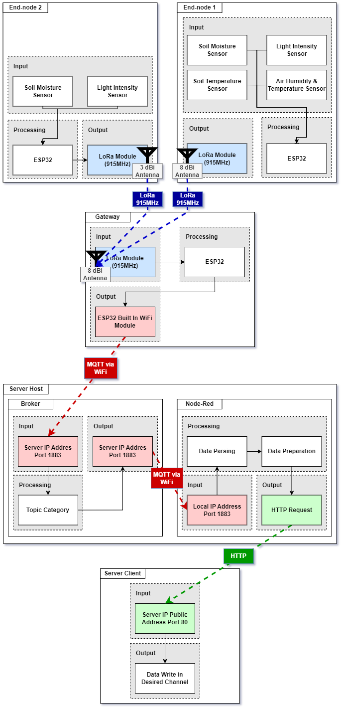
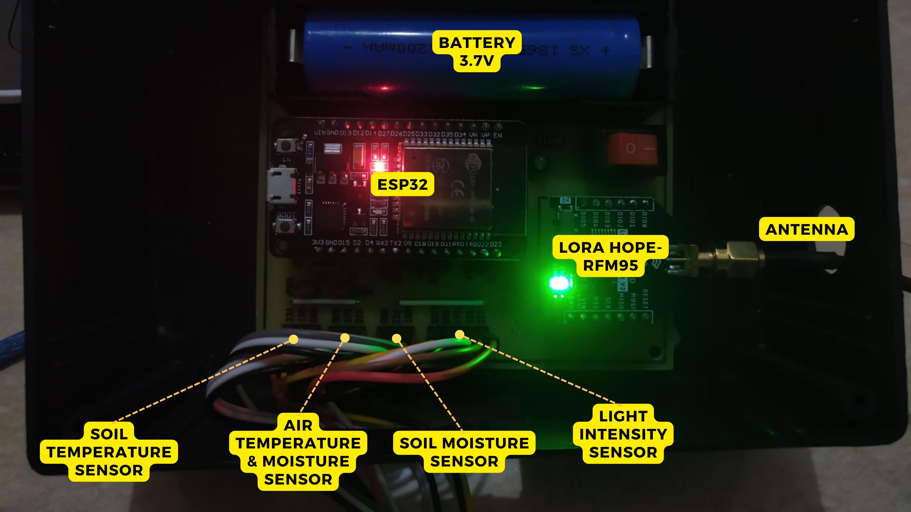
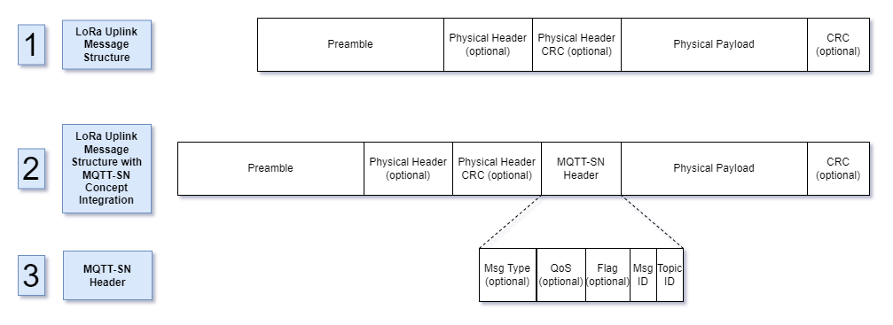

# Agricultural IoT System with LoRa and MQTT-SN

Welcome to our repository! This project showcases a robust IoT system designed for environmental monitoring in agricultural settings, specifically implemented in the UB Forest, Karangploso. Our system seamlessly integrates multiple technologies to ensure reliable data collection and transmission across various network components.

### System Architecture Overview
Our system is segmented into four key components based on their network functions, all connected through a gateway:
1. **End-node Component**: Utilizes an ESP32 microcontroller to process data from environmental sensors like a capacitive soil moisture sensor and a BH1750 light intensity sensor. The data is formatted into MQTT-SN messages and transmitted via LoRa packets using the RFM9x module.
2. **Gateway Component**: Another ESP32 microcontroller receives the LoRa packets, decodes the MQTT-SN messages, and converts them into standard MQTT format. The data is then forwarded to the server where Node-RED is installed, using the ESP32's WiFi capability.
3. **Broker Component**: The server employs the Aedes MQTT Broker library within Node-RED to set up the MQTT broker. This broker processes the data, organizes it by topics, and facilitates data access through client subscriptions.
4. **Client Component**: Clients can be local (using a UI dashboard library on Node-RED) or external (using Thingspeak and its REST API to display data).

This structure enables seamless data flow from sensor readings to user interfaces for monitoring and analysis.

### Physical Design
- **Physical form of the node and gateway**: 
  
- **Internal design of the end-node**: 
  
- **Internal design of the gateway**: 
  
- **Location Scheme**: 
  

### Study Location and Data Collection
This study is conducted in the UB Forest, Karangploso, characterized by its mountainous terrain and small community setup. The area experiences regular rainfall during the rainy season, surrounded by trees 10 to 30 meters tall. Data collection involves capturing sensor readings, end-node IDs, and gateway RSSI values, sent directly from the end-points to the server and clients.

During field data collection, the gateway is set up in the UB Forest with internet connectivity. End nodes are positioned at intervals from 1 meter up to potentially beyond 400 meters, each transmitting 11 sets of data points.

### MQTT-SN Scheme in LoRa

Picture 6 details the MQTT-SN integration with LoRa, showing:
1. **LoRa Uplink Message Structure**: Includes preamble, physical header, physical header CRC, physical payload, and CRC.
2. **Uplink Message Structure with MQTT-SN Integration**: Adds MQTT-SN headers to the existing LoRa structure.
3. **MQTT-SN Header Structure**: Selectively incorporates headers to optimize the message structure, avoiding redundancy by leveraging overlapping functionalities between MQTT-SN and LoRa.

This strategic approach ensures efficient message organization, streamlined data sorting, and enhanced communication protocol reliability.

### Technologies Used
- ESP32
- LoRa
- Thingspeak
- MQTT-SN

We hope you find this project as exciting and insightful as we do. Dive in to explore more about how these technologies come together to create a powerful solution for environmental monitoring in agriculture!
